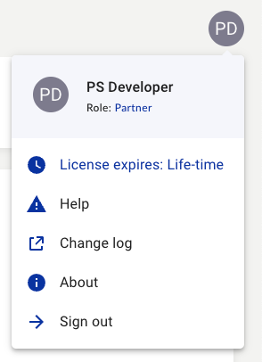

The **Profile Menu** can be accessed by clicking on your avatar in the top right corner. If you do not have an avatar picture set in [Glip®](https://app.ringcentral.com) you will see an auto-generated avatar containing your intials.

If you wish to add an avatar to [Glip®](https://app.ringcentral.com) that can be used by this application, follow the instructions for [adding an avatar to your Glip profile](https://support.ringcentral.com/app/users/desktop-web/editing-profile-ringcentral-app-desktop-web.html).

This menu has five (5) options that can be used for locating your [IVR Orchestrator](https://ivrorchestrator.ps.ringcentral.com) app subcription expiration, finding help, accssing the change log, the web app about information and signing out of the application. The **profile menu** is where you can find the remaining duration of your IVR Orchestrator app license/subscription.

## Options
* **App subscription expiration-** indicates amount of time left in current IVR Orchestrator app liscense/subscription.
* **Help center-** links to support and documentation.
* **Change log-** links to the change log.
* **About-** build information and acknowledgements.
* **Sign out-** sign out of the application (terminates current session).

