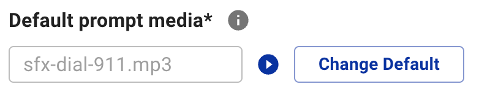

The **default prompt media** is the media file that is assigned to the IVR by default from your RingCentral account IVR configuration. This prompt media can be added and changed with the IVR Orchestrator but it must have media present for this application to be able to add new scheduled prompt media.

This application will combine all scheduled media with the default prompt media into a **combined prompt media file**. The default prompt media will always play last in this sequence, with the scheduled media items playing in the order identified by scheduled media list.

Changing the default prompt media can be done in bulk, to more than one IVR at once. Learn more about [Bulk Editing Default Prompts](ivr/bulk-ivr-editing).

## Editing Default Prompt Media

To edit the default prompt media, **click on the IVR name** or the checkbox to select and then click the **Edit** button from the main IVR datatable. 

Once you see the IVR prompt(s) configuration, follow these steps to change default media:

1. Click the **Change default** button.
2. Select the media file to be used as the default prompt in the **default prompt dialog menu**.
3. Click the **save** button and a success or error confirmation dialog will confirm final results.

* After any actions to an IVR Prompt, the application will require you to **Sync Changes** or you will lose your edits.

