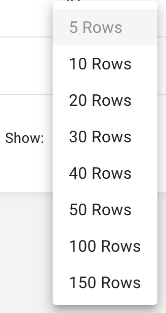

The main **IVR datatable** shows all IVR’s found in your [RingCentral®](https://ringcentral.com) account and their associated prompt media. The datatable displays information about each IVR, it's current prompt media file, and any custom columns pulled from the IVR names via the Optional Naming Conventions.

Clicking on the name of any IVR in the data table, or by selecting one or more and clicking **Edit**, will allow you to see the prompt media currently in use for the selected IVR(s).

*[Multi-Level IVR's](https://support.ringcentral.com/article/6562.html) must be implemented on the account to use this application.*

*When visiting the IVR section, it might take up to one minute to load the IVR details and associated prompt media found in your [RingCentral®](https://ringcentral.com) account.*

## Columns
* **Name-** the name of this IVR. *Click on the name of a IVR to edit its prompt media.*
* **Applied Media-** the current IVR prompt media being used by the IVR when an inbound call occurs.
* **EXT-** the extension used by this IVR.
* **Site-** the site this IVR is assigned to.
* **Custom Fields-** any custom fields pulled by the Optional Naming Convention feature will be displayed after the first four columns and will be indicated as custom fields with the star icon.

## Optional Naming Convention
IVR’s using the optional naming convention are further recognized by this application. These values are used to create custom columns in the IVR section data table that allows for grouping/filtering based on unique business-specific logic.

Learn more about the [Optional Naming Convention](ivr/optional-naming-convention).

## Sorting
By default the data is sorted by the **Name** value in a descending order. To change the sort order of a column click the name of the column you would like to sort. It will cycle through the following options:

* **Descending-** first click
* **Ascending-** second click
* **Default-** third click

## Overflow Menu
Each row in the datatable has an overflow icon (  ) that, when clicked, will open up a dropdown menu with the following options:

* **Edit IVR Prompt-** edit the prompt media configuration of the selected IVR.

*The overflow menu is a shortcut, the same options are available as datatable actions above the datatable.*

## Pagination
At the bottom of the datatable are the pagination elements. To the left is the **page selection** that allows you to select a page and to the right are the **rows per page** and **total entries**.

### Pagination Options
Quickly traverse between all of the pages in the datatable by clicking on a page number or by clicking the pagination buttons displayed to the left and right of the page numbers:

*  first page
*  previous page
*  next page
*  last page

When there are more than 3 pages, an empty page box will appear. Enter the desired page number and then click outside the box or hit enter to quickly view the specified page.

### Rows Per Page
Click on the up or down arrows next to the **rows per page** text to change the number of entries displayed on each page of the datatable:

### Entries
Entries displays the total count of existing notifications.