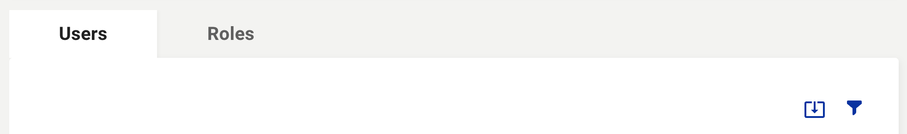

The **Roles datatable actions** are the primary way to interact with the Roles datatable. These actions can be found directly above the datatable.

## Users and Roles Tabs
Switch between the [Users datatable](users/user-datatable) view and the Roles datatable view.

## Export
The Export icon (  ) will export all entries in the datatable to .xlsx file format. *Alternatively, you can select the checkbox(es) next to the row item(s) to export only the selected entries.*

## Filter
The Filter icon (  ) opens the filter options menu. Here you can use preset filters options from the dropdown menu and then type your keyword to filter the datatable. To add another filter, click the **'Add Filter'** button below the last entry. To clear all filters, click on the **'Clear All'** button.

* To add another filter, click the **Add Filter** button below the last entry. 

* To clear all filters, click on the **Clear All** button.

## Roles Datatable Switches
The Roles datatable also features switches in the datatable row items to enable **read-only (RO)** or **read-write (RO)** access to each individual section of this application per given role.

Learn more in [Editing Role Permissions](users/editing-role-permissions). 
