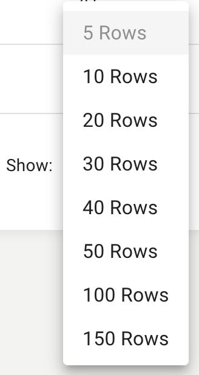

The **Roles datatable**, under the Roles tab, displays the roles from your [RingCentral®](https://ringcentral.com) account and associated permissions they have regarding their access to [IVR Orchestrator](https://ivrorchestrator.ps.ringcentral.com). The datatable displays information about each role found in your account, if that roles has access to IVR Orchestrator, IVR section permission levels, IVR default media permission levels, media section access permission levels and user section access permission levels.

## Role Datatable Columns
* **Name-** the name of this user role. 
* **App Access-** shows if IVR Orchestrator access is enabled or disabled for the role.
* **IVR Access-** read-write or read-only access permissions for the IVR section of the app.
* **Default Media-** read-write or read-only access permissions for IVR prompts.
* **Media Access-** read-write or read-only access permissions for the Media section of the app.
* **User Access-** read-write or read-only access permissions for the User section of the app.

A list of all roles present in your RingCentral account is automatically populated into the roles section. Permissions can be set for each existing role. 

Learn more in [Editing Role Permissions](users/editing-role-permissions).

The built-in super admin role is hardcoded with permanent RW access to avoid the potential of accidentally getting locked out. *A user with a* **super admin** *role on the RingCentral account must perform the initial role-enablement for other users of this application.*

## Sorting
By default the data is sorted by the **Role Name** value in a descending order. To change the sort order of a column click the  sort arrows icon next to the column name you would like to sort. It will cycle through the following options:

* **Descending-** first click
* **Ascending-** second click
* **Default-** third click

## Pagination
At the bottom of the datatable are the pagination elements. To the left is the **page selection** that allows you to select a page and to the right are the **rows per page** and **total entries**.

### Pagination Options
Quickly traverse between all of the pages in the datatable by clicking on a page number or by clicking the pagination buttons displayed to the left and right of the page numbers:

*  previous page
*  next page

When there are more than 3 pages, an empty page box will appear. Enter the desired page number and then click outside the box or hit enter to quickly view the specified page.

### Rows Per Page
Click on the up or down arrows next to the **rows per page** text to change the number of entries displayed on each page of the datatable:

### Entries
Entries displays the total count of existing notifications.